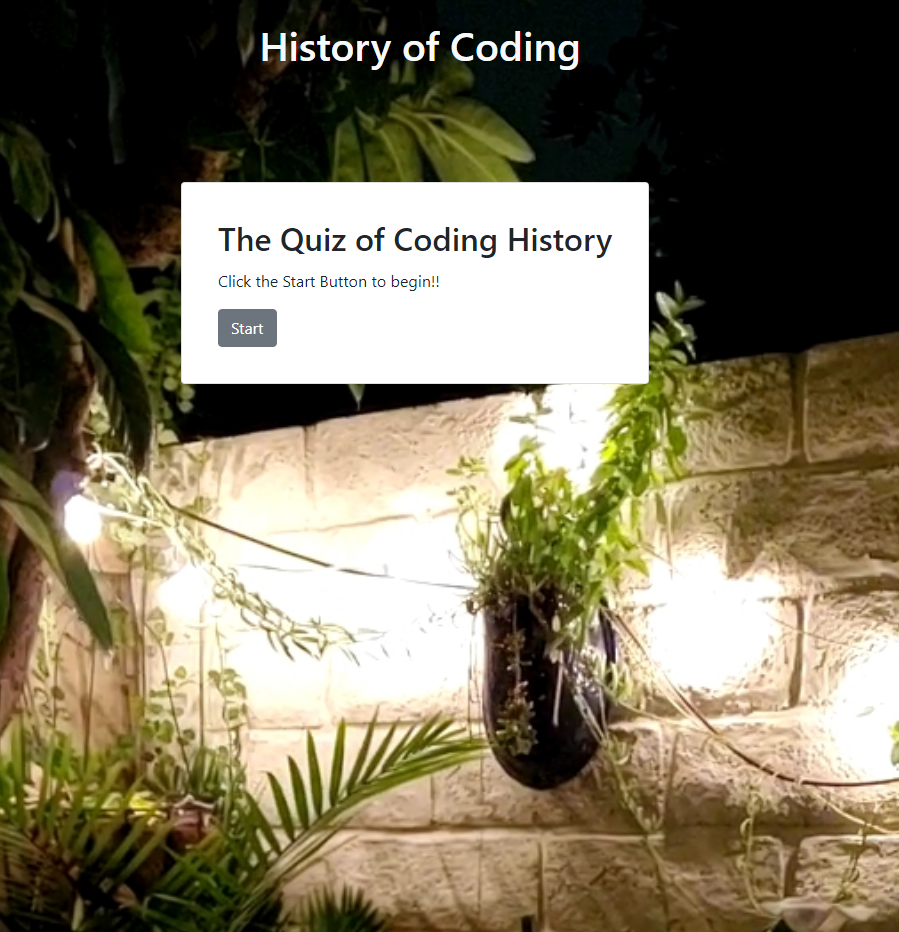
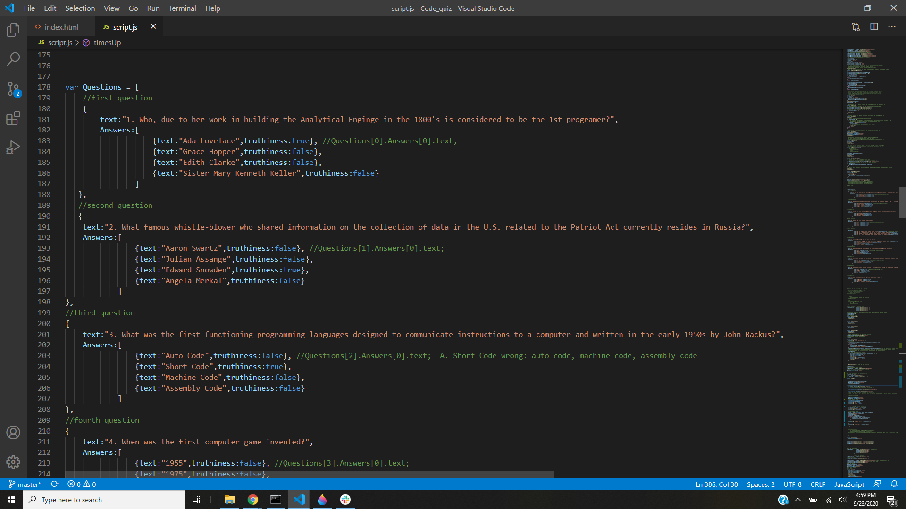
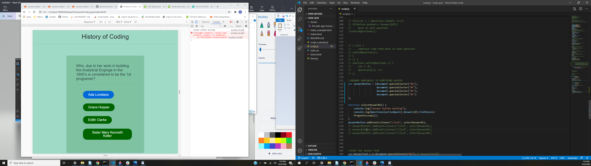
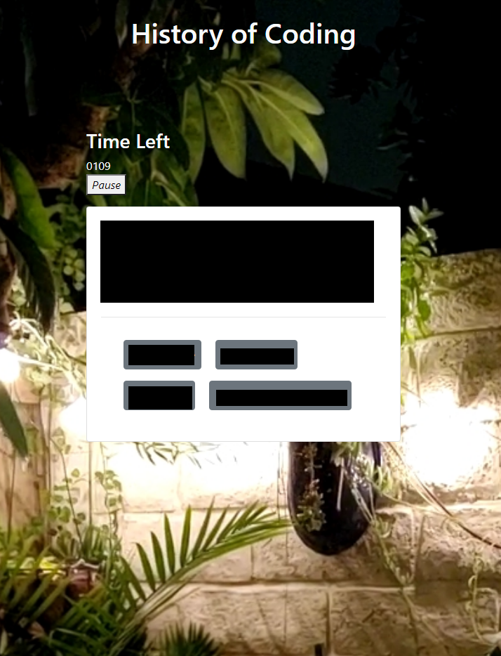
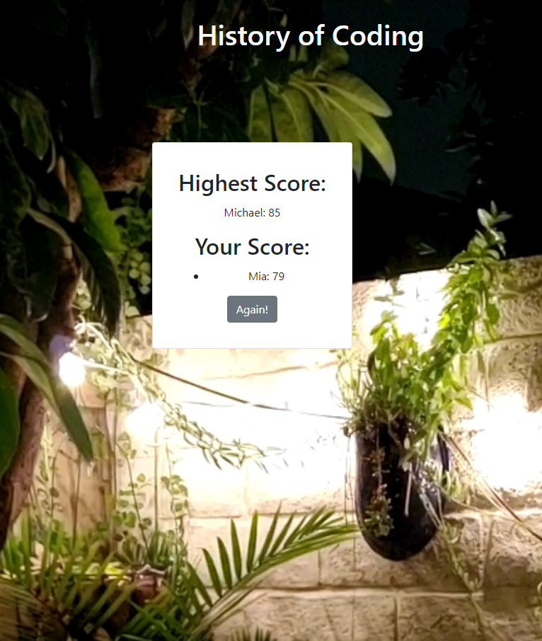

<!-- 
AS A coding bootcamp student
I WANT to take a timed quiz on JavaScript fundamentals that stores high scores
SO THAT I can gauge my progress compared to my peers
```


```
GIVEN I am taking a code quiz
WHEN I click the start button
THEN a timer starts and I am presented with a question
WHEN I answer a question
THEN I am presented with another question
WHEN I answer a question incorrectly
THEN time is subtracted from the clock
WHEN all questions are answered or the timer reaches 0
THEN the game is over
WHEN the game is over
THEN I can save my initials and score
```

The following animation demonstrates the application functionality:


### Review

You are required to submit the following for review:

* The URL of the functional, deployed application.

* The URL of the GitHub repository. Give the repository a unique name and include a README describing the project. -->

#  JavaScript: Code Quiz

### The goal of this project is to make a timed quiz on Javascript fundamentals that stores high scores to help learn about coding. 



## Table of Contents
* [Technologies Used](Technologies_Used)
* [Deployed Site](Deployed)
* [Features](Features)
* [Usage](Usage)
* [Author](Author)
* [Credits](Credits)
* [License](License)

## Technologies_Used
* HTML (23.7%) (Bootstrap)
* CSS (5.7%) (minor styling)
* Javascript (70.6%)

## Deployed Site
[Code Quiz](https://rksouth.github.io/Code_quiz/)

## Features 


__1. A series of Questions and Answers__
 
_Why?_

To test the users knowledge of basic coding history and their recall on a quick question-by-question basis. It also helps with the timer aspect because if you have to scroll while you are on a clock then you might miss a question or spend all your time just moving up and down the screen. 

_What?/How?_

   

I think the most important part of this was to realize that we needed a large object of both questions and answers. There are a lot of ways to do it but it was extremely important to know when/what your question and answer is. I chose to set my answers to a true/false boolean instead of having them randomly appear on the page. 

I also carefully labeled out (in the comments) what the exact position in the array my questions were. Again keeping a strong organized system in the beginning allowed me to rapidly build functions that switched on and off based off of selections.

Discussing with my fellow developers, there were a multitude of ways to right the functions that picked about this object. I ended up using a for loop that checked each question and iterated it through based off of a series of properties.

__2. A Timer__

_Why?_

Because some people want to rapidly remember and recall subject matter. I am not one of those people, however I do understand the need to put a little pressure on yourself to learn something and learn it by heart. The timer adds a bit of competition to the quiz which, in turn, makes it more fun.


_What?/How?_
	


I think, one of more challenging and interesting aspects of the timer was the fact that we had to take time away from it if you got an answer. Therefore, it was important to place that aspect of it in relation to where true/false were checked. 

__3. A High Score__

_Why?_

What's the point in having a competition with no highscore? 


_What?/How?_

There were two ways I knew to do this; either use local.storage to hold the scores in the browser and then compare them (so that they last in the game) or store them in an array. I chose an array because the code was simpler, smaller and did the same job of storing that a local would. 

'   toLoad = {name:initialInput.value, value:finalScore}; ' 
'    console.log("ToLoad: " + toLoad); ' 

'     var championName;    ' 
'     championScore = 0; ' 
'     scoreArray.push(toLoad); ' 
'     for (i=0; i<scoreArray.length; i++){ ' 
'         if (scoreArray[i].value >= championScore){ ' 
'             championScore=scoreArray[i].value; ' 
'             championName=scoreArray[i].name; ' 
'         }; ' 
' 
'     console.log("champion score: " + championScore); ' 
'         // creating champion score
'         championship.textContent = championName + ": "+ championScore; ' 
'         championship.setAttribute("data-index", key); ' 
'         console.log(championship.textContent); '


As you can see above, my scoreArray[] takes the variable toLoad which contains the name of the contestant and their final score.It then checks the scores of all the previous additions and checks for the highest score. It's not very complicated but it does run most of the entire last card on the page (aside from the HTML).

__3. Look and Feel__

   


Above is an earlier build. I originally had some CSS style on the sheet, however I wanted to make my design more elevated and I didn't feel like the styling fit the subject matter. So, I chose to use bootstrap instead.



Above is the what questions looked like with the final style. The tiles is never moved and the timer was placed so it would be easily visible on the left hand top side of the questions. Your eyes don't have to wander too far if you are concerned about your time.



Above is an image of the high score screen. This is what pops out when you have reached the end of your quiz and have submitted your name. If someone has taken the lest before you, then their name may also show up. You can compare where you are with the highest score and figure out who to beat. 

## Usage
### This is to help students learn a difficult subject matter but also very interesting, the history of coding.

## Author 
Rachael Kelm-Southworth

* [linkedin] (https://www.linkedin.com/in/rachael-kelm-southworth-87a3831b3) 

* [github] (https://github.com/RKSouth/)

 ## Credits

I would like to thank Kerwin, Manuel, Roger, Jerome and all my classmates for helping me understand this subject matter.

## License
[MIT](https://choosealicense.com/licenses/mit/)


